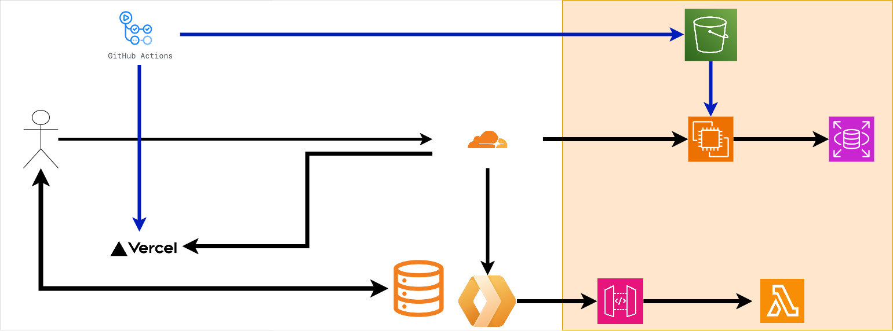

# CHAP_Grpc

位置情報共有型コミュニケーションアプリ
## 開発環境

### クイックスタート

```bash
# 開発環境の起動（ホットリロード有効）
make dev

# ログの確認
make dev-logs

# 開発環境の停止
make dev-down
```

### 利用可能なエンドポイント

- **gRPCサーバー**: `localhost:50051`
- **HTTP API (Envoy)**: `http://localhost:8080`
- **Swagger UI**: `http://localhost:3000`

### 開発時の機能

- **ホットリロード**: Goファイルを変更すると自動で再ビルド・再起動
- **プロトバッファー自動生成**: `make generate`でprotoファイルから自動生成

### 使用技術

- Go 
- gRPC
- Protocol Buffers
- Docker & Docker Compose
- PostgreSQL


## プロジェクト構成

```
CHAP_Grpc/
├── backend/           # Goサーバー
│   ├── api/          # Protocol Buffers定義と生成コード
│   ├── handler/      # gRPCハンドラー
│   ├── infra/        # インフラ層（DB、リポジトリ）
│   ├── middleware/   # ミドルウェア
│   └── utils/        # ユーティリティ
├── envoy/            # Envoyプロキシ設定
├── docs/             # Swagger UI
└── scripts/          # 開発用スクリプト
```

## 開発コマンド

```bash
# 開発環境
make dev              # ホットリロードで開発環境起動
make dev-down         # 開発環境停止
make dev-logs         # 開発ログ表示

# 本番環境
make prod             # 本番環境起動
make prod-down        # 本番環境停止

# その他
make clean            # コンテナ・ボリューム削除
make generate         # プロトバッファー生成
```

